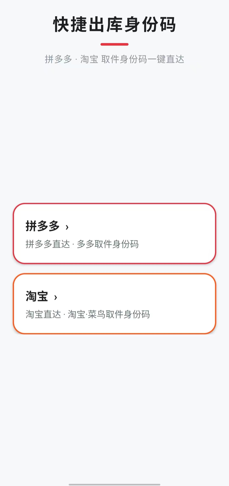

# ExpressIdentify · 身份码快捷入口

> 拼多多 · 淘宝 取件身份码一键直达



一个只有两张卡片的极简 Android 应用：点一下直接跳到当前账号的**取件身份码**页面，省掉「打开 App → 找入口 → 找身份码」的每一步。

## 特性

- **一键直达** —— 拼多多卡片用 `pinduoduo://` 深链打开多多取件身份码页；淘宝卡片按「HTTPS 页面 → `taobao://` scheme → 复制链接」三级回退，总有一种方式能打开。
- **永远是实时码** —— 每次点击都重新进入对应页面，展示的是当前登录账号此刻生成的动态身份码，不存在过期截图。
- **零权限、零网络请求** —— 不申请任何 Android 权限，不集成第三方 SDK，应用自身不联网，也不保存账号 Cookie、Token 或身份码。
- **长按复制** —— 长按任意卡片即可复制对应的原始站点链接，方便贴到别处打开。
- **轻量** —— 纯 Java、单 Activity、无 Kotlin 运行时依赖，APK 约 5 MB。

## 安装

不用构建，直接下载打包好的签名 APK 安装即可：

**[⬇ ExpressIdentify-1.0.8.apk](releases/ExpressIdentify-1.0.8.apk)** （`versionCode 9` · minSdk 24 · 已用发布签名签好）

也可以从 [Releases](https://github.com/Farstars163/ExpressIdentify/releases) 下载同一份 APK。

> 若系统提示「禁止安装未知来源应用」，允许本应用安装来源即可。

## 构建（可选）

只有修改代码时才需要构建。环境要求：JDK 17 · Android SDK（compileSdk 35) · 使用仓库自带的 Gradle 8.5 Wrapper

```powershell
.\gradlew.bat assembleDebug --offline
```

APK 输出：`app/build/outputs/apk/debug/app-debug.apk`

依赖版本全部固定，Kotlin stdlib 占位构件放在 `local-repo/`，因此按 `--offline` 构建（本仓库的构建方式）即可，不需要联网。

### Release 签名

签名用的 keystore 与密码**不入库**。要打签名 release，请在仓库根目录放置：

1. `identitycode.keystore`
2. `keystore.properties`：

```properties
storeFile=identitycode.keystore
storePassword=<你的密码>
keyAlias=<你的别名>
keyPassword=<你的密码>
```

然后执行 `.\gradlew.bat assembleRelease --offline`。缺少这两个文件时 release 会产出未签名 APK，`assembleDebug` 不受影响。

## 使用

1. 安装 APK。
2. 手机上保持拼多多 / 淘宝为已登录状态。
3. 点击卡片进入实时身份码页面；长按卡片复制原始链接。
4. 站点编号在 `MainActivity` 中修改（`station_code` / 站点链接）。

## 实现说明

卡片里的链接只是站点入口，**不包含**最终身份码：身份码依赖当前拼多多 / 淘宝账号的登录会话，由页面实时返回。所以本应用采用「定向打开对应应用页面」的方式——省掉扫码和翻菜单，同时继续拿到当前有效的动态码。

链接中的站点编号目前固定为：

- 拼多多：`A029765297`
- 淘宝 / 菜鸟：`420485`

## 项目结构

```
app/src/main/java/com/local/identitycode/MainActivity.java   唯一 Activity：两张卡片 + 深链跳转 + 长按复制
app/src/main/res/layout/activity_main.xml                    首页布局
app/src/main/res/drawable/                                   卡片与标题装饰背景
app/src/main/AndroidManifest.xml                             <queries> 声明拼多多 / 淘宝等目标应用
docs/screenshot.jpg                                          首页截图
releases/ExpressIdentify-1.0.8.apk                           已签名的发布 APK，直接安装
local-repo/                                                  离线构建用的 Maven 占位构件
```

## 说明

- 包名：`com.local.identitycode`，应用名「身份码」。
- 本项目为个人自用工具，与拼多多、淘宝、菜鸟无任何官方关联；站点链接与编号如有变动请自行修改。
